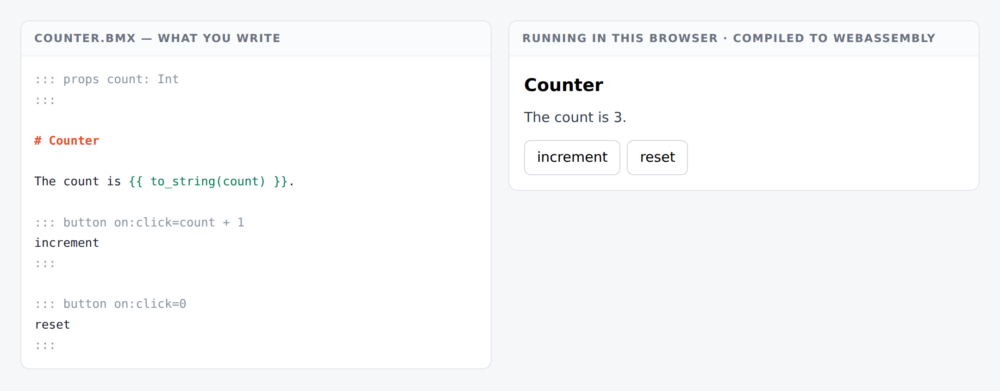
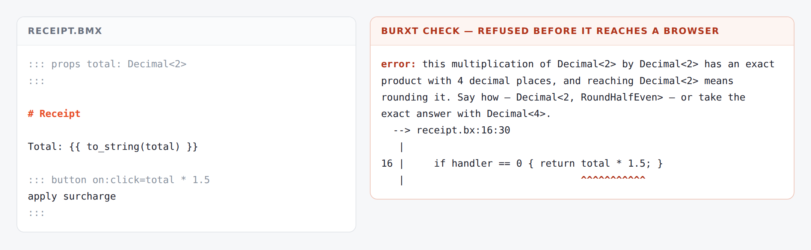



# star-burxt

**A `.bmx` file is a component.** It renders, it takes events, it holds state — and the compiler
refuses what is wrong about all three before anything reaches a browser.

```
::: props count: Int
:::

# Counter

The count is {{ to_string(count) }}.

::: button on:click=count + 1
increment
:::
```

That is the whole component. It becomes a `pure function counter(count: Int) -> Html` and a
`pure function counter_dispatch(handler: Int, count: Int) -> Int`, compiles to WebAssembly, and
runs in a browser.

<figure class="shot">
  
  <figcaption>Not a mockup — the right-hand panel is that document compiled to WebAssembly and
  clicked three times.</figcaption>
</figure>

## What makes it different

**The compiler judges your event handlers.** Not a lint, not a runtime check — the ordinary rules
of the language, reaching a place they have never been:

```
::: button on:click=total * 1.5          (total is a Decimal<2>)
```

```
error: this multiplication of Decimal<2> by Decimal<2> has an exact product with
4 decimal places, and reaching Decimal<2> means rounding it. Say how —
Decimal<2, RoundHalfEven> — or take the exact answer with Decimal<4>.
```

**Narrowing money inside a click handler is a compile error.** No framework whose handlers are
closures can see that, and not through carelessness — a closure's captured state is invisible to
the signature.

<figure class="shot">
  
  <figcaption>The refusal points into the <em>generated</em> component, because the handler is
  ordinary code by the time it is judged.</figcaption>
</figure>

## Three properties, and none of them were designed

They fall out of decisions Burxt made years earlier for unrelated reasons, which is the best
argument that they will keep holding.

**Handlers cannot go stale.** Burxt has no closures — declined in `DESIGN.md` because a closure
needs an owner for its captured state, which is a memory question in a language whose memory model
is regions. With nothing to capture, a handler must be an expression producing the next state.
There is no dependency array, because nothing freezes. There is no `useCallback`, because a handler
is an index rather than a function object.

**Hydration cannot mismatch.** A component rendered natively and the same component rendered in
WebAssembly produce byte-identical output — checked on every build. Server and client cannot
disagree about a page, because they are running the same compiled code.

**A page carries nothing executable.** A handler reaches the browser as `data-star-h="0"`, an
index. One delegated listener calls into the module. There is no inline handler anywhere, which is
[BMX's §4a.5](https://bmx.burxt-lang.org/building-on.html) satisfied literally rather than
approximately.

## It is small

| | gzipped |
|---|---|
| the compiled component and framework | 4.2 KB |
| the DOM reconciler | 1.8 KB |
| the driver | 1.9 KB |
| **total** | **7.7 KB** |

For comparison, React with ReactDOM is around 45 KB gzipped before you write anything. That is a
measurement of what ships, not a benchmark — see [what is not done](not-done.html) for the honest
limits, which include the cases where star-burxt is currently the slower of the two.

## Start here

- **[Getting star-burxt](install.html)** — one line in `burxt.package`, and the Burxt it needs
- **[Your first component](guide/01-your-first-component.html)** — the four-chapter guide
- **[When it refuses](refusals.html)** — every refusal, with the reason
- **[What is not done](not-done.html)** — read this before choosing it for anything real


